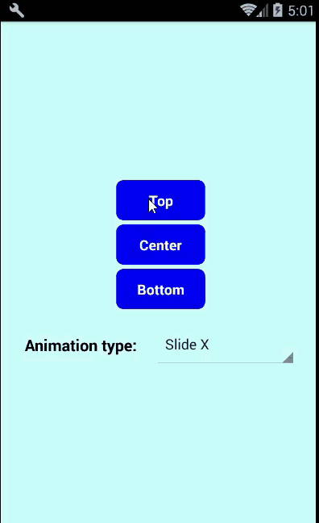

# react-native-animated-message
A message component using animations for react native support for both Android and iOS
## Demo

## Installation
`npm i react-native-animated-message`
## Example
Check [Example.js](https://github.com/quocnguyenvan/react-native-animated-message/blob/master/example/Example.js) file in the example folder.
Or you can run the built examples step by step as below:
1. Clone the repository:
```
git clone https://github.com/quocnguyenvan/react-native-animated-message.git
```
2. cd to `example`: `cd react-native-animated-message/example`
3. Install dependencies: `npm install`
4. Finally, run the apps:
- iOS:
```
react-native run-ios
``` 
- Android:
```
react-native run-android
```
## Usage
```js
import Message from 'react-native-animated-message';

<View style={styles.container}>
  <Button 
    title="Show top"
    onPress={()=> this.message.showMessage('This is a message', 3000)}
  />
  <Message
    ref={(message) => this.message = message }
    animation={'slideX'}
    position={'top'}>
  </Message>
</View>
```
## Method
- <b>showMessage</b>(<b>`message`</b>: *string*, <b>`duration`</b>: *number*)
## Props
|  Prop | Default  | Type | Description |
| :------------ |:---------------:| :---------------:| :-----|
| animation | slideX | `string` | Animation for message (`slideX`, `slideY` or `zoom`) |
| position | top | `string` | Determine the position of message (`top`, `center` or `bottom`)
| messageHeight | 60 | `number` | The height of message
| textStyle | {color: 'white', fontSize: 16, fontWeight: 'bold', textAlign: 'center'} | `style` | Style for message text
| messageStyle | {backgroundColor: 'green'} | `style` | Style applied to the message
### MIT Licensed
